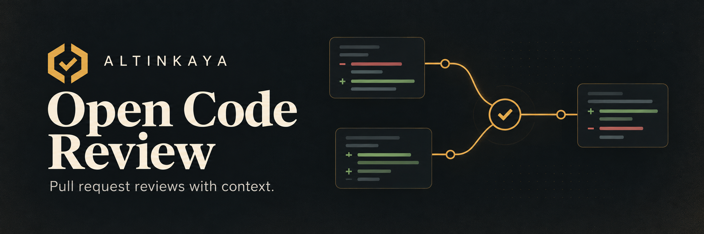

<p align="center">
  
</p>

# Altinkaya Open Code Review

AI-assisted pull request reviews for GitHub, powered by
[Alibaba's Open Code Review](https://github.com/alibaba/open-code-review) or
[PR-Agent](https://github.com/The-PR-Agent/pr-agent).
We share our setup as a reference for teams running their own review infrastructure.

[Technical guide](docs/guide.md) · [Workflow](.github/workflows/ocr-review.yml) · [Contribute](#contribute)

## What it adds

- **Linked PR context.** Review changes alongside related PRs, including across repositories.
- **Finding history.** Track open, resolved and reopened findings across reviews.
- **Controlled execution.** Review a read-only checkout in Bubblewrap; keep GitHub credentials outside the sandbox.
- **Shared maintenance.** Reuse one workflow, cache Git objects locally and receive upstream version updates as PRs.

## Review policy

Reviews use one pass, focused on changed behavior and directly affected callers.
Repositories can opt into PR-Agent with `OCR_REVIEW_ENGINE=pr-agent`.
It reviews bounded diff chunks with the same bot policy, sandbox and finding history.
See the [PR-Agent setup](docs/pr-agent.md).

| Finding | GitHub review | OCR result |
| --- | --- | --- |
| Critical / High | Request changes | Gray |
| Medium | Comment | Gray |
| Low only / None | Approve* | Green |
| No files selected | No approval | Green |
| Incomplete review | No approval | Red |

Low findings produce no finding comments. Earlier open findings still count.
Approval requires complete coverage of selected files; intentional exclusions
do not fail CI. GitHub's Actions job has its own status.
*GitHub prevents a bot from approving its own PR.*

## Connect related work

Add dependencies to the PR description:

```text
Depends-On: example-api#123
Related-PR: #45
```

Updates to a linked PR trigger another review of its direct dependents.
Reviews also rerun on PR updates and cancel when the PR closes or merges.

## Use it in your organization

Fork this repository, adapt the organization and bot checks, and configure your
own runner and LLM credentials. The current workflow accepts Altinkaya repositories.
Follow the [setup guide](docs/guide.md#adapt-it-for-your-organization), then adopt
it in one repository before expanding.

## Contribute

Bug reports, focused pull requests and reproducible review cases are welcome.
Run the regression suite before submitting code changes:

```sh
python3 -m unittest discover -s ocr -p 'test_*.py'
```

Built by [Altinkaya](https://github.com/altinkaya-opensource).
Review engines: [Alibaba Open Code Review](https://github.com/alibaba/open-code-review)
and [PR-Agent](https://github.com/The-PR-Agent/pr-agent).
